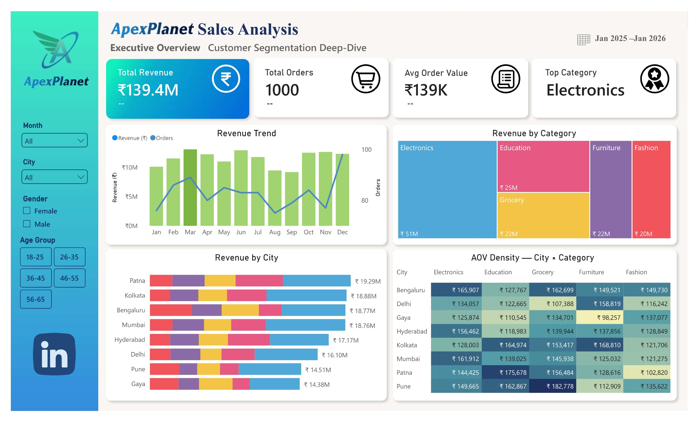
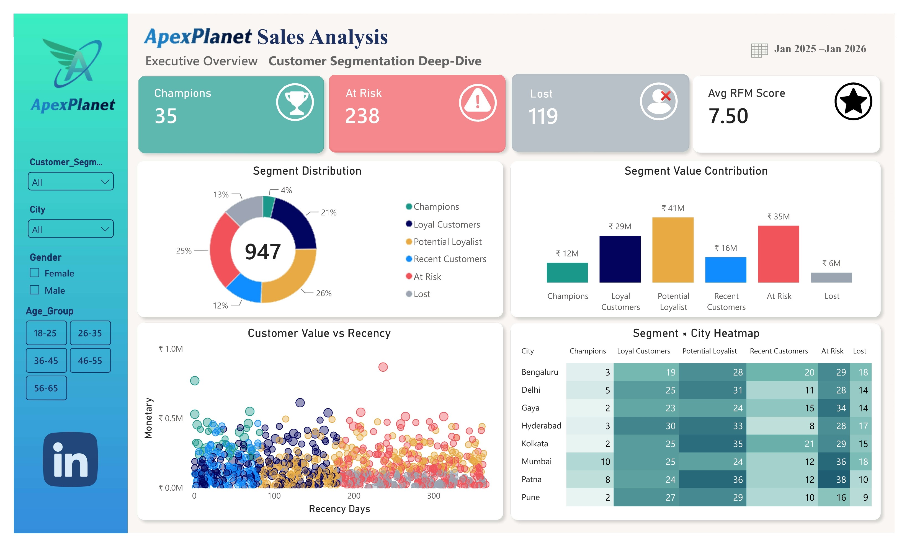

<div align="center">

# 📊 ApexPlanet Data Analytics Internship
## Task 1, Task 2, Task 3 & Task 4 — From Data Wrangling to Data Storytelling & Statistical Inference


**Data Analytics Internship Project**

**Author:** Brojo Mohan Dutta

</div>

---

# 📌 Project Overview

This repository contains the data analytics projects completed during the **ApexPlanet Software Pvt. Ltd. Data Analytics Internship**.

The project demonstrates a complete analytical workflow beginning with **raw data cleaning and wrangling**, followed by **SQL-based business analysis**, **Exploratory Data Analysis (EDA)**, **statistical interpretation**, **business intelligence**, **deep-dive customer segmentation**, **interactive dashboarding**, and finally **hypothesis testing, statistical inference, data storytelling, and business strategy**.

The objective throughout the internship is to transform raw sales data into meaningful, actionable business insights using industry-standard analytics tools and techniques.

---

# 🚀 Complete Project Workflow

```text
Raw Excel Dataset
        │
        ▼
Data Cleaning & Wrangling
        │
        │ Task 1
        ▼
Clean Analytical Dataset
        │
        ▼
SQL Business Analysis
        │
        │ Task 2
        ▼
Python Exploratory Data Analysis
        │
        ▼
Statistical & Multivariate Analysis
        │
        ▼
Business Dashboard Mock-Up
        │
        │ Task 3
        ▼
Deep-Dive Customer Analysis
        │
        ▼
RFM Customer Segmentation
        │
        ▼
Interactive Power BI Dashboard
        │
        │ Task 4
        ▼
Hypothesis Testing
        │
        ▼
Statistical Inference
        │
        ▼
Data Storytelling
        │
        ▼
Business Recommendations
        │
        ▼
Final Capstone Strategy
```

---

# 📂 Repository Structure

```text
ApexPlanet-Internship/
│
├── ApexPlanet-Task1-Data-Wrangling/
│   │
│   ├── 01_data/
│   │      ApexPlanet_DataAnalytics_Dataset.xlsx
│   │      cleaned_sales_dataset.csv
│   │
│   ├── 02_notebook/
│   │      ApexPlanet_Task1_Data_Wrangling.ipynb
│   │
│   ├── 03_report/
│   │      ApexPlanet_Task1_Data_Wrangling_Report.pdf
│   │
│   ├── 04_src/
│   │      clean_pipeline.py
│   │
│   ├── README.md
│   └── LICENSE
│
│
├── ApexPlanet-Task2-EDA&Business-Intelligence/
│   │
│   ├── 01_sql/
│   │      ApexPlanet_Task2_EDA_BI_SQL_Queries.sql
│   │
│   ├── 02_notebook/
│   │      ApexPlanet_Task2_Multivariate_EDA_Dashboard.ipynb
│   │      ApexPlanet_Task2_Python_EDA.py
│   │
│   ├── 03_report/
│   │      SQL Analysis Report
│   │      Python EDA Report
│   │
│   ├── 04_dashboard/
│   │      dashboard_mockup.png
│   │      charts/
│   │
│   ├── README.md
│   └── LICENSE
│
│
├── ApexPlanet-Task3-Deep-Dive-Analysis&Interactive-Dashboarding/
│   │
│   ├── 01_datasets/
│   │      cleaned_sales-data.csv
│   │      customer_rfm_segments.csv
│   │
│   ├── 02_power_bi/
│   │      apexplanet_sales_customer_rfm_analysis.pbix
│   │      Executive_Overview.jpg
│   │      Customer_Segmentation.jpg
│   │
│   ├── 03_report/
│   │      ApexPlanet_Task3_Deep_Dive_Report.pdf
│   │
│   ├── README.md
│   └── LICENSE
│
│
├── ApexPlanet-Task4-Data-Storytelling&Statistical-Inference/
│   │
│   ├── 01_dataset/
│   │      sales_dataset_python_analysis.csv
│   │
│   ├── 02_notebook/
│   │      Hypothesis Testing & Statistical Inference.ipynb
│   │      Hypothesis Testing & Statistical Inference.py
│   │      hypothesis1_gender_analysis.png
│   │      hypothesis2_age_category_analysis.png
│   │
│   ├── 03_documentation/
│   │      Hypothesis Testing & Statistical Inference.docx
│   │      Hypothesis Testing & Statistical Inference.pdf
│   │
│   ├── 04_presentation/
│   │      ApexPlanet_Capstone_Presentation.pdf
│   │      ApexPlanet_Capstone_Presentation.pptx
│   │
│   ├── README.md
│   └── LICENSE
│
│
├── README.md
└── LICENSE
```

---

# 🧹 Task 1 — Data Wrangling

## Objective

Prepare the raw Excel sales dataset for analytical use by identifying and correcting common data quality issues.

---

## Cleaning Pipeline

✔ Imported Excel dataset

✔ Checked dataset dimensions

✔ Identified missing values

✔ Removed duplicate records

✔ Standardized categorical values

✔ Converted data types

✔ Parsed date columns

✔ Removed invalid records

✔ Engineered analytical features

✔ Exported cleaned dataset

---

## Python Libraries

- Pandas
- NumPy

---

## Deliverables

- Cleaned CSV Dataset
- Jupyter Notebook
- Python Script
- Technical Report

---

# 📈 Task 2 — Exploratory Data Analysis & Business Intelligence

## Objective

Perform business-focused exploratory data analysis using SQL and Python to uncover sales trends, customer behavior, product performance, and revenue insights.

---

# 🛠 Tools & Technologies

| Tool | Purpose |
|------|---------|
| Python | Data Analysis |
| Pandas | Data Manipulation |
| NumPy | Numerical Analysis |
| Matplotlib | Visualization |
| Seaborn | Statistical Visualization |
| Google BigQuery | SQL Analytics |
| SQL | Business Queries |
| Jupyter Notebook | Analysis Environment |
| Git | Version Control |
| GitHub | Portfolio |
| Power BI | Business Intelligence |

---

# 📊 Business Questions Answered

- Monthly Revenue Trend
- Best Selling Products
- Category Performance
- City-wise Sales Analysis
- Customer Demographics
- High Value Customers
- Repeat Customer Analysis
- Month-over-Month Growth
- Customer Value Analysis
- Revenue Contribution by Category
- Geographic Revenue Distribution

---

# 📉 Exploratory Data Analysis

The Python analysis includes:

- Correlation Matrix
- Pair Plot
- Scatter Plot
- Heatmaps
- Boxplots
- Statistical Summary
- Multivariate Analysis
- Executive Dashboard Mock-Up

---

# 📊 Dashboard Components

The executive dashboard contains:

- Total Revenue KPI
- Total Orders KPI
- Average Order Value
- Top Product Category
- Monthly Revenue Trend
- Revenue by Category
- Top Cities
- Revenue by Age Group
- Gender Revenue Share
- Category × City Heatmap

---

# 📷 Dashboard Preview


---

# 📌 Key Insights

### Data Wrangling

- Missing values were identified and handled.
- Duplicate records were investigated and addressed.
- Data formatting and types were standardized.
- Date fields were transformed for analytical use.
- The dataset was prepared for downstream SQL and Python analysis.

---

### SQL Analysis

- Electronics generated the highest revenue.
- Monthly revenue remained relatively stable overall.
- Major cities contributed significantly to total revenue.
- Most customers were one-time buyers.
- Customer retention opportunities were identified.
- Month-over-month category performance revealed periods of significant growth and decline.

---

### Exploratory Data Analysis

- Unit Price and Quantity show strong relationships with Total Sales.
- Age has a relatively weak linear relationship with revenue.
- Product category has a stronger relationship with sales performance than several demographic variables.
- Revenue distribution was examined across gender and age groups.
- Multivariate analysis was used to identify relationships between numerical and categorical variables.

---

# 🔎 Task 3 — Deep-Dive Analysis & Interactive Dashboarding

## Objective

Perform a deep-dive analysis of a key business area and build an interactive dashboard that surfaces core KPIs and allows stakeholders to explore the analysis.

The selected deep-dive area for Task 3 is:

> **Customer Segmentation using RFM Analysis**

The analysis focuses on understanding customer value and identifying customer groups that can support targeted business strategies.

---

# 🎯 Task 3 — Core KPIs

### Total Revenue

Measures the overall revenue generated by the business.

```text
Total Revenue = SUM(Total_Sales)
```

### Total Orders

Measures the number of unique transactions.

```text
Total Orders = DISTINCTCOUNT(Order_ID)
```

### Total Customers

Measures the size of the customer base.

```text
Total Customers = DISTINCTCOUNT(Customer_ID)
```

### Average Order Value

Measures the average revenue generated per order.

```text
AOV = Total Revenue / Total Orders
```

---

# 🔬 Task 3 — Deep-Dive Analysis

## Customer Segmentation — RFM Analysis

The deep-dive analysis uses **RFM methodology** to understand customer behavior and value.

### RFM Dimensions

| Dimension | Meaning |
|-----------|---------|
| **Recency** | How recently a customer made a purchase |
| **Frequency** | How frequently a customer made purchases |
| **Monetary** | How much revenue a customer generated |

These dimensions are combined to classify customers into meaningful business segments.

---

# 👥 Customer Segments

The Power BI dashboard analyzes customer groups including:

- Champions
- Loyal Customers
- Potential Loyalists
- New / Recent Customers
- At Risk
- Lost

---

# 📊 Task 3 — Interactive Power BI Dashboard

The Power BI dashboard consists of two main analytical pages.

---

## 1️⃣ Executive Overview

The Executive Overview provides a high-level view of business performance.

### KPIs

- Total Revenue
- Total Orders
- Average Order Value
- Top Category

### Visualizations

- Revenue Trend
- Revenue by Category
- Revenue by City
- City × Category AOV Analysis

### Interactive Filters

- Month
- City
- Gender
- Age Group

---

## 2️⃣ Customer Segmentation — RFM Deep Dive

The second dashboard page provides a detailed analysis of customer segments.

### KPIs

- Champions Count
- At Risk Count
- Lost Count
- Average RFM Score

### Visualizations

- Customer Segment Distribution
- Segment Value Contribution
- Segment × City Analysis
- Customer Value vs Recency
- Customer-level RFM Analysis

### Interactive Filters

- Customer Segment
- City
- Gender
- Age Group

---

# 📷 Task 3 Dashboard Preview

### Executive Overview



### Customer Segmentation



---

# 💡 Task 3 — Key Business Insights

- RFM analysis identifies customers with different levels of engagement and monetary value.
- Potential Loyalists represent a major customer-value opportunity.
- At Risk customers represent an important retention opportunity.
- Lost customers highlight customers with low recent engagement.
- Customer value can be compared across different cities and demographic groups.
- Interactive filtering allows stakeholders to investigate customer segments dynamically.

---

# 📌 Task 3 — Business Value

The deep-dive analysis can support:

- Identification of high-value customers
- Customer retention analysis
- Customer lifecycle management
- Targeted customer strategies
- Geographic customer analysis
- Customer value optimization
- Data-driven business decisions

---

# 📊 Interactive Dashboard

The Power BI dashboard provides interactive exploration of the analytical results.

### 🔗 Live Power BI Dashboard

**[View Interactive Dashboard](YOUR_POWER_BI_LIVE_DASHBOARD_LINK)**

> Replace `YOUR_POWER_BI_LIVE_DASHBOARD_LINK` with your published Power BI dashboard URL.

---

# 📄 Task 3 Report

The complete methodology, KPI definitions, RFM analysis, dashboard explanation, insights, and business recommendations are documented in the Task 3 report.

---

# 🧪 Task 4 — Data Storytelling & Statistical Inference

## Objective

Task 4 moves from descriptive analysis to **statistical validation**.

The objective is to test business assumptions using formal statistical methods and determine whether observed differences or patterns are statistically meaningful or could reasonably be attributed to random variation.

The Task 4 analysis focuses on two business hypotheses:

1. **Gender-Based Spending Difference**
2. **Age Group & Category Preference Independence**

The statistical analysis was performed using **Python, SciPy, Pandas, Matplotlib, and Seaborn**.

---

# 🎯 Task 4 — Hypothesis Framework

## Hypothesis 1 — Gender-Based Spending

### Business Question

> Do male and female customers spend significantly different amounts per order?

### Null Hypothesis

```text
H₀: μMale = μFemale
```

There is no difference in mean Total Sales between male and female customers.

### Alternative Hypothesis

```text
H₁: μMale ≠ μFemale
```

There is a difference in mean Total Sales between male and female customers.

### Statistical Test

**Independent Two-Sample T-Test**

### Significance Level

```text
α = 0.05
```

---

## 📊 Hypothesis 1 — Finding

The analysis reported **no statistically significant difference in spending between male and female customers**.

The business interpretation is that the observed difference in average spending does not provide sufficient statistical evidence for a gender-based spending strategy.

Therefore, customer targeting can instead focus on stronger behavioral dimensions such as **RFM lifecycle stage and customer value**. :contentReference[oaicite:2]{index=2}

---

# 📊 Hypothesis 2 — Age Group & Category Preference

### Business Question

> Is customer age group independent of product category preference?

### Null Hypothesis

```text
H₀: Age_Group and Category are independent
```

There is no significant association between age group and category preference.

### Alternative Hypothesis

```text
H₁: Age_Group and Category are not independent
```

There is a significant association between age group and category preference.

### Statistical Test

**Chi-Square Test of Independence**

### Significance Level

```text
α = 0.05
```

### Effect Size

**Cramér's V** was also calculated to evaluate the strength of the association.

---

# 📊 Hypothesis 2 — Finding

The analysis reported **no statistically significant association between age group and product category preference**.

Although some age groups showed small differences in category distribution, the statistical evidence did not support treating those differences as a reliable basis for age-specific category targeting. :contentReference[oaicite:3]{index=3}

---

# 📈 Task 4 — Statistical Analysis Workflow

```text
Clean Analytical Dataset
        │
        ▼
Define Business Hypothesis
        │
        ▼
Define H₀ and H₁
        │
        ▼
Select Statistical Test
        │
        ▼
Check Statistical Assumptions
        │
        ▼
Calculate Test Statistic
        │
        ▼
Calculate P-Value
        │
        ▼
Compare Against α = 0.05
        │
        ▼
Statistical Decision
        │
        ▼
Business Translation
        │
        ▼
Actionable Recommendation
```

---

# 🧮 Statistical Methods Used

### Hypothesis 1

- Independent Two-Sample T-Test
- Shapiro-Wilk Normality Test
- Levene's Test
- 95% Confidence Interval
- Box Plot
- KDE Distribution

### Hypothesis 2

- Contingency Table
- Chi-Square Test of Independence
- Expected Frequencies
- Standardized Residuals
- Cramér's V
- Normalized Stacked Bar Chart

The Python implementation includes the assumption tests, statistical calculations, confidence interval analysis, effect-size calculation, and visualizations. :contentReference[oaicite:4]{index=4} :contentReference[oaicite:5]{index=5} :contentReference[oaicite:6]{index=6}

---

# 📷 Task 4 Visualizations

### Hypothesis 1 — Gender-Based Spending


This visualization compares the distribution of Total Sales across male and female customers using a box plot and KDE distribution.

---

### Hypothesis 2 — Age Group & Category


This visualization compares category distribution across age groups using a normalized stacked bar chart.

---

# 💡 Task 4 — Business Translation

The statistical analysis provides an important guardrail for business decision-making.

### Gender

The analysis did not find statistically significant evidence of different spending behavior between male and female customers.

This means demographic gender segmentation should not automatically be treated as a strong driver of customer spending.

### Age & Category

The analysis did not find statistically significant evidence that category preference differs systematically by age group.

Therefore, age-based category targeting should be approached cautiously rather than assuming that observed differences represent stable customer behavior.

### Stronger Business Signals

The broader analysis points toward behavioral and transactional factors such as:

- RFM lifecycle stage
- Customer value
- Category performance
- Geographic AOV variation
- Electronics revenue concentration

as important areas for business analysis.

---

# 📖 Task 4 — Data Storytelling

Task 4 connects statistical analysis with business storytelling.

The analytical journey moves from:

```text
Observation
     ↓
Business Question
     ↓
Hypothesis
     ↓
Statistical Test
     ↓
Evidence
     ↓
Business Interpretation
     ↓
Recommendation
```

This approach ensures that recommendations are supported by analytical evidence rather than relying only on visual patterns.

---

# 🏆 Final Capstone — From Data to Strategy

The **ApexPlanet Sales & Customer Analytics Capstone** brings the four internship tasks together into one complete analytical story.

The final presentation follows the journey:

```text
Data Wrangling
      ↓
EDA & Business Intelligence
      ↓
RFM Segmentation
      ↓
Statistical Validation
      ↓
Data Storytelling
      ↓
Business Strategy
```

The capstone presentation summarizes the complete analytical workflow and translates the findings into business recommendations. :contentReference[oaicite:7]{index=7}

---

# 📊 Final Capstone Highlights

The final analysis presents:

- ₹139.4M Total Revenue
- 1,000 Orders
- 947 Unique Customers
- ₹139.4K Average Order Value
- Electronics contributing 36.4% of revenue
- RFM-based customer segmentation
- Customer value and retention analysis
- Statistical hypothesis testing
- Business recommendations
- Revenue growth opportunities

The capstone presentation describes the analytical dataset as 1,000 transactions across the reporting period and identifies Electronics as the largest single category by revenue. :contentReference[oaicite:8]{index=8}

---

# 🎯 Strategic Business Themes

The complete analysis identified several strategic areas:

### 1. Customer Retention

RFM segmentation highlights different customer lifecycle groups and creates a basis for targeted retention and reactivation strategies.

### 2. Customer Value

Customer value analysis helps distinguish highly engaged customers from customers requiring re-engagement.

### 3. Category Concentration

Electronics represents a significant share of overall revenue, making category concentration an important business consideration.

### 4. Demographic Validation

Statistical testing helps determine whether demographic differences should actually influence marketing decisions.

### 5. Data-Driven Strategy

The final capstone translates analytical findings into practical business initiatives and measurable strategic opportunities.

---

# 🛠 Complete Technology Stack

| Technology | Application |
|------------|-------------|
| **Python** | Data Analysis & Statistical Analysis |
| **Pandas** | Data Manipulation |
| **NumPy** | Numerical Analysis |
| **Matplotlib** | Data Visualization |
| **Seaborn** | Statistical Visualization |
| **SciPy** | Hypothesis Testing |
| **SQL** | Business Analysis |
| **Google BigQuery** | SQL Analytics |
| **Power BI** | Interactive Dashboarding |
| **DAX** | KPI & BI Measures |
| **Power Query** | Data Transformation |
| **Jupyter Notebook** | Analysis Environment |
| **Git** | Version Control |
| **GitHub** | Portfolio & Documentation |

---

# 📚 Complete Skills Demonstrated

### Data Analytics

- Data Cleaning
- Data Wrangling
- Data Validation
- Exploratory Data Analysis
- Multivariate Analysis
- Statistical Analysis
- Statistical Inference
- Hypothesis Testing
- Data Storytelling

### Programming & Querying

- Python
- Pandas
- NumPy
- SQL
- Google BigQuery
- SciPy

### Business Intelligence

- Power BI
- DAX
- Power Query
- Interactive Dashboard Development
- KPI Development
- Data Visualization
- Business Intelligence

### Customer Analytics

- RFM Analysis
- Customer Segmentation
- Customer Value Analysis
- Customer Behavior Analysis
- Retention Analysis

### Statistical Methods

- Independent Two-Sample T-Test
- Shapiro-Wilk Test
- Levene's Test
- Confidence Interval Analysis
- Chi-Square Test of Independence
- Cramér's V
- Contingency Analysis
- Standardized Residual Analysis

### Professional Skills

- Business Problem Solving
- Analytical Thinking
- Business Storytelling
- Data-Driven Decision Making
- Dashboard Design
- Technical Documentation
- Git
- GitHub
- Presentation Development

---

# 📈 Learning Outcomes

This internship strengthened practical knowledge in:

- Data preprocessing
- Data quality assessment
- SQL querying
- Exploratory data analysis
- Statistical interpretation
- Multivariate analysis
- Customer segmentation
- RFM analysis
- KPI development
- Power BI dashboard development
- Hypothesis testing
- Statistical inference
- Data storytelling
- Business strategy
- Business recommendations
- Data visualization
- Interactive reporting
- Professional documentation
- GitHub portfolio development

---

# 📦 Internship Deliverables

| Task | Major Deliverables |
|------|--------------------|
| **Task 1** | Cleaned Dataset, Notebook, Python Script, Report |
| **Task 2** | SQL Queries, Python EDA, Visualizations, Dashboard Mock-Up, Reports |
| **Task 3** | RFM Dataset, Power BI Dashboard, Dashboard Screenshots, Deep-Dive Report |
| **Task 4** | Dataset, Python Analysis, Jupyter Notebook, Statistical Visualizations, Documentation, Capstone Presentation |

---

# 🚀 Internship Progress

| Task | Focus Area | Status |
|------|------------|--------|
| **Task 1** | Data Wrangling | ✅ Completed |
| **Task 2** | EDA & Business Intelligence | ✅ Completed |
| **Task 3** | Deep-Dive Analysis & Interactive Dashboarding | ✅ Completed |
| **Task 4** | Data Storytelling & Statistical Inference | ✅ Completed |
| **Capstone** | End-to-End Sales & Customer Analytics Strategy | ✅ Completed |

---

# 📂 Task 4 Deliverables

The Task 4 folder contains:

### Dataset

- `sales_dataset_python_analysis.csv`

### Python Analysis

- `Hypothesis Testing & Statistical Inference.ipynb`
- `Hypothesis Testing & Statistical Inference.py`

### Visualizations

- `hypothesis1_gender_analysis.png`
- `hypothesis2_age_category_analysis.png`

### Documentation

- `Hypothesis Testing & Statistical Inference.docx`
- `Hypothesis Testing & Statistical Inference.pdf`

### Final Presentation

- `ApexPlanet_Capstone_Presentation.pptx`
- `ApexPlanet_Capstone_Presentation.pdf`

---

# 📄 Documentation

Each task contains supporting documentation covering the methodology, analysis, findings, and business interpretation.

The Task 4 documentation specifically covers the hypothesis framework, statistical tests, results, visualizations, and business translation. :contentReference[oaicite:9]{index=9}

---

# 🎓 Final Capstone Presentation

The final presentation combines the complete internship journey into a single business-focused story:

> **From Raw Data to Revenue Strategy**

It connects:

**Data → EDA → RFM → Validation → Strategy**

and demonstrates how analytical findings can be translated into business recommendations. :contentReference[oaicite:10]{index=10}

---

# 📬 Contact

**Brojo Mohan Dutta**

📧 brojomohan58@gmail.com

🔗 **LinkedIn:**  
https://www.linkedin.com/in/brojomohandutta

💻 **GitHub:**  
https://github.com/brojomohan58-boop

---

<div align="center">

## ⭐ If you found this project helpful, consider giving it a Star!

### ApexPlanet Data Analytics Internship

**Task 1 • Task 2 • Task 3 • Task 4 • Capstone**

**Data → Insights → Validation → Strategy**

</div>
